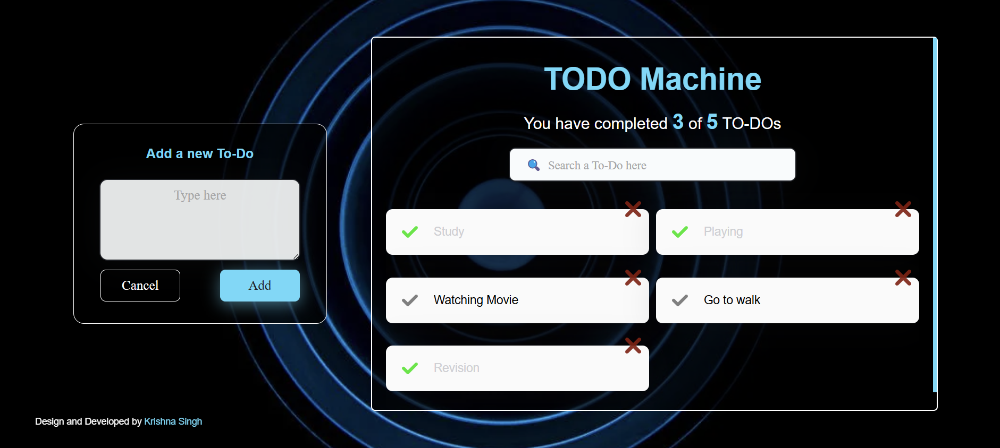

# ✅ To-Do App

A simple yet efficient **To-Do List Application** built with React.js, designed to help users manage their daily tasks effectively.

## 🌍 Live Demo
[Live App](#) *(Update with your deployed link)*

## 📌 GitHub Repository
[To-Do App Source Code](#) *([Update with your repo link](https://github.com/singhkrishna01/TO-DO-MACHINE))*

---

## 🎯 Features
- 📌 **Add Tasks** – Easily create new tasks.
- ✏️ **Edit Tasks** – Modify task details anytime.
- ✅ **Mark as Complete** – Track completed tasks.
- ❌ **Delete Tasks** – Remove tasks when done.
- 🎨 **User-Friendly UI** – Clean and minimalistic design.
- 🌙 **Dark Mode** – Toggle between light and dark themes.

## 🖼️ Screenshots
### 📌 Home Page


## 🛠️ Tech Stack
- **HTML, CSS, JavaScript** – Core web technologies
- **React.js** – Frontend framework
- **Bootstrap** – Responsive design and styling
- **LocalStorage** – Persist tasks across sessions

## 📂 Project Structure
```
To-Do-App/
│── public/
│── src/
│   ├── components/
│   │   ├── TaskList.js
│   │   ├── TaskItem.js
│   │   ├── TaskForm.js
│   ├── assets/
│   ├── styles/
│   ├── App.js
│   ├── index.js
│── package.json
│── README.md
```

## 🚀 How to Run the Project
1. Clone the repository:
   ```sh
   git clone https://github.com/your-username/todo-app.git
   ```
2. Navigate to the project folder:
   ```sh
   cd todo-app
   ```
3. Install dependencies:
   ```sh
   npm install
   ```
4. Start the development server:
   ```sh
   npm start
   ```
5. Open your browser and visit:
   ```sh
   http://localhost:3000
   ```

## 🎯 Future Enhancements
- 🔔 **Notifications** – Remind users about pending tasks.
- 📅 **Due Dates** – Set deadlines for tasks.
- 🏆 **Task Categories** – Organize tasks into categories.

## 📞 Contact
📩 **Email:** your.email@example.com  
🔗 **GitHub:** [your-username](https://github.com/your-username)  
🔗 **LinkedIn:** [Your Profile](https://www.linkedin.com/in/your-profile)  
